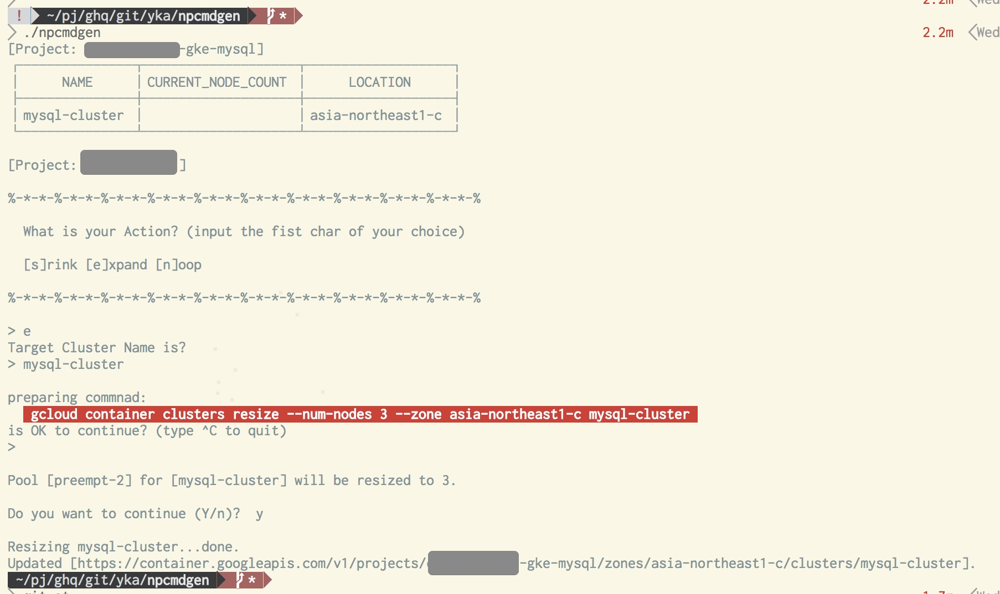

# npcmdgen: GKE NodePool resize wrapper utility

* Goodbye to bored, too long command-line for Resize GKE NodePool.

## overview



* select action, execute resize.

## Setup

1. Copy the config-template-file `dot.npcmd_default.template` to: `~/.npcmd_default`
1. Edit that file, for your environment.

## How to use

* It's simple. run this:

```shell
$ ./npcmdgen
-> ...
```

* and, follow the wizard.

## Known issue

* Project selecting
* Cluster Name selecting
* and so on...